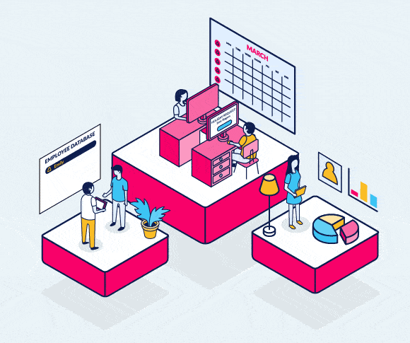

> #  **`ATLIQ HR Exploratory Data Analysis`**

____
**`Live Preview:`** 
To see live dashboard click [here.](https://app.powerbi.com/view?r=eyJrIjoiN2Y5ZDIwMjQtYTQyMC00NWI5LTliNzktMWMzNzJjMDhmYTEzIiwidCI6IjYyZjIxODFlLWY4ZjQtNDVjZS05NzE0LTIyNTIyYjE2OWY1NSIsImMiOjl9)
____

**`Author Name:`** Malik Hasnain Ali\
**`Email ID:`** 512yaali@gmai.com\
**`Linkedin profile:`** [hasnainali99](https://www.linkedin.com/in/hasnainali99/)

____
**`Data Source:`**\
It is a secondary data which is collected from the following [link](https://codebasics.io/resources/resume-project-data-analytics)
____
**`Data Collection:`**\
Data collected can be seen as a raw .xlsx file here
____
**`Data Storage:`**\
The collected data has been stored in the excel file name as Atliq_HR.xlsx. Each id in the dataset is uniquely identified by its Employee Id.
____
**`Data Publish Year:`**
- 2021
____
**`Tools:`**
- Google Chrome
- Markdown
- Excel
- Power BI
- Data Modelling
- Data cleaning 
- M Language
____
**`Data Cleaning/Preparation:`**\
In the initial data preparation phase, we performed the following tasks:
1. Data loading and inspection
2. Handling Missing values
3. Handling Outliers
4. Data Cleaning and formating
____
## **The dataset collected from the source has the following description** 

**`Description:`**\
AtliQ was established in 2017 as an IT services company to help businesses integrate their processes with automated tools. Over the past 5 years, AtliQ has successfully provided many businesses with custom solutions that help them scale, or streamline their processes, reduce overhead costs and increase overall efficiency.

As a multinational company located in the United States and India, we cater to businesses from all corners of the world. Our insightful strategies and reliable processes have helped us assist various industries with remarkable results. Our resourcefulness has led to satisfied clients, successful collaborations, and rapid growth.

It is our mission to continue serving companies with innovative software solutions and assisting them in their digital transformation.♨️
____
**`Acknowledgements`:**
I would like to thank [Codebasics](https://codebasics.io/) for helping me collecting data

